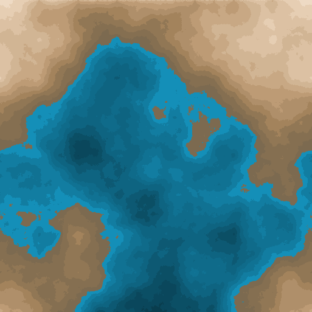

# Terragen
A terrain generator written in Python

## Instructions

1. Install PyPy
2. Run `source env/bin/activate`
3. Run `pip install -r requirements.txt`
4. Run `python setup.py manage`
5. Run `python run.py`
